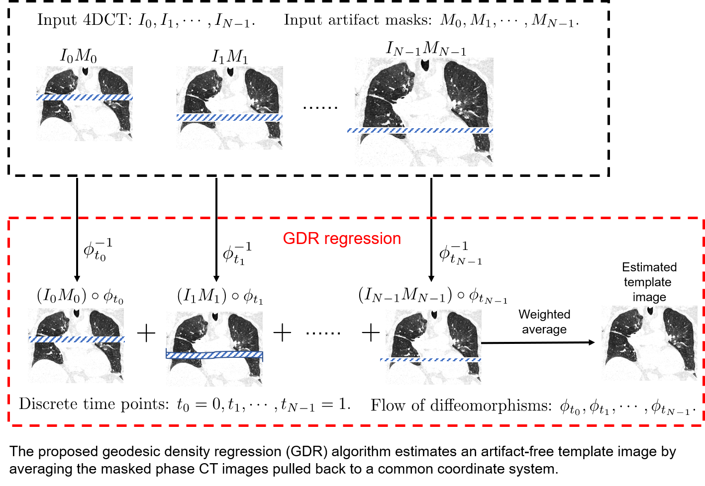
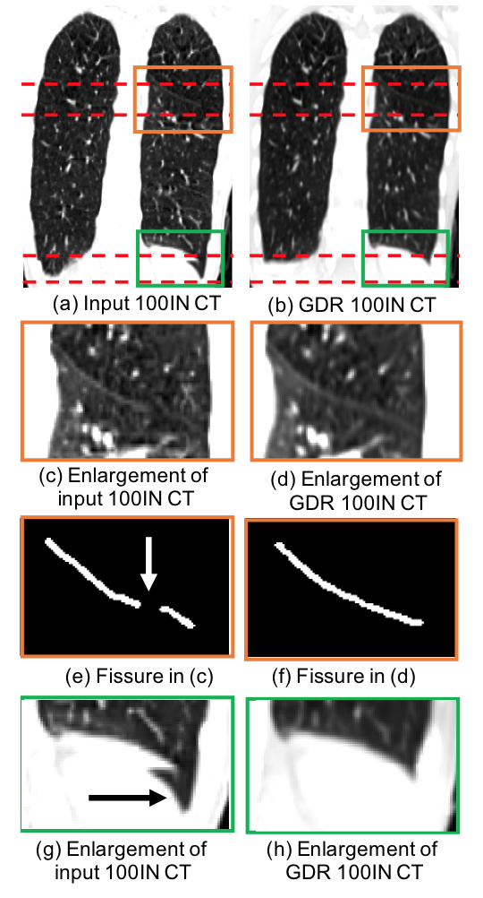

# Geodesic Density Regression for Correcting 4DCT Pulmonary Respiratory Motion Artifacts

This is a C++ implementation of a Geodesic Density Regression (GDR) algorithm presented in the following research paper:

Shao, Wei, et al. "Geodesic Density Regression for Correcting 4DCT Pulmonary Respiratory Motion Artifacts" [Medical Image Analyis]

### Introduction
The GDR algorithm removes respiratory motion artifacts in 4DCT lung images by (1) using binary artifact masks to exclude artifact regions from the regression, and (2) accommodating image intesnity change associated with breathing by using a tissue density deformation action.

This code has been tested on several treatment planing 4DCT scans and the following representative result demonstrates its promising performance in reducing real motion artifact.

### Computation Requirement
To efficiently run the GDR code, we recommend a minimum computer memory of 256GB and a minimum number of CPU cores to be 16.
