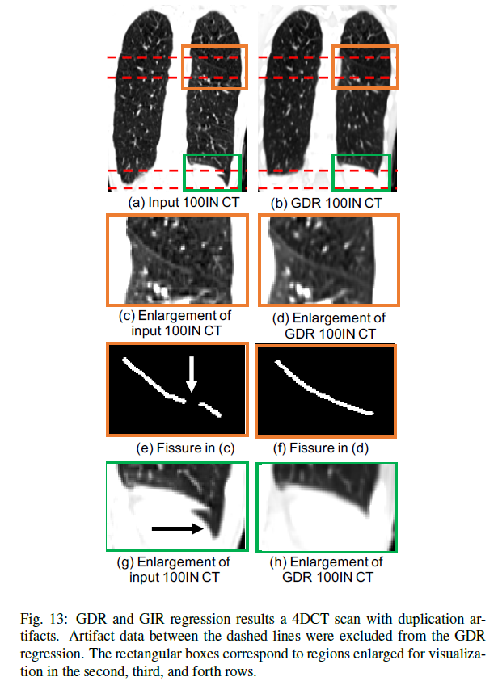

# Geodesic Density Regression for Correcting 4DCT Pulmonary Respiratory Motion Artifacts


This is a C++ implementation of a Geodesic Density Regression (GDR) algorithm presented in the following research paper:

Shao, Wei, et al. "Geodesic Density Regression for Correcting 4DCT Pulmonary Respiratory Motion Artifacts" [Medical Image Analyis]

### Introduction
The GDR algorithm removes respiratory motion artifacts in 4DCT lung images by (1) using binary artifact masks to exclude artifact regions from the regression, and (2) accommodating image intesnity change associated with breathing by using a tissue density deformation action.

This code has been tested on several treatment planing 4DCT scans and the following representative result demonstrates its promising performance in reducing real motion artifact.


### Computation Requirement
To efficiently run the GDR code, we recommend a minimum computer memory of 256GB and a minimum number of CPU cores to be 16.

### How to Install
1. Clone the repository:
```
git clone https://github.com/Wei-Shao-Reg/GDR.git
```
2. Install the Insight Toolkit (ITK)
```
1) Download ITK 4.8.2 source code: 
wget https://sourceforge.net/projects/itk/files/itk/4.8/InsightToolkit-4.8.2.tar.gz
tar xvzf InsightToolkit-4.8.2.tar.gz
```
4. 

### BibTeX

If you use this code, please cite the following paper:

```bibtex
@article{Shao_GDR_2021,
	year = 2021,
	author = {Wei Shao and Yue Pan and Oguz C. Durumeric and Joseph M. Reinhardt and John E. Bayouth and Mirabela Rusu and Gary E. Christensen},
	title = {Geodesic Density Regression for Correcting {4DCT} Pulmonary Respiratory Motion Artifacts},
	journal = {Medical Image Analysis}
}
```
