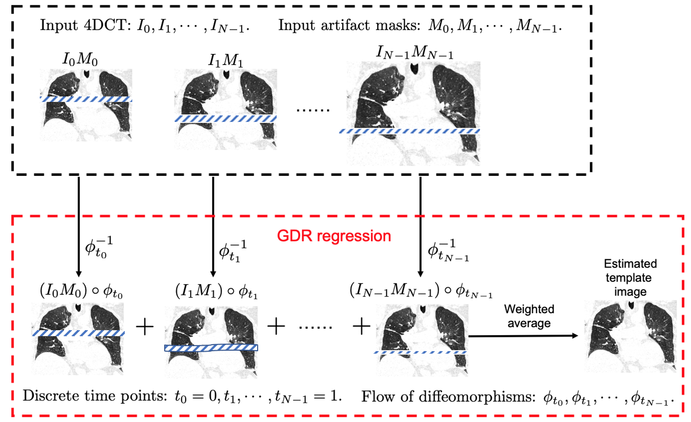

# Geodesic Density Regression for Correcting 4DCT Pulmonary Respiratory Motion Artifacts

This is a C++ implementation of the following research paper:

Shao, Wei, et al. "Geodesic Density Regression for Correcting 4DCT Pulmonary Respiratory Motion Artifacts" [Medical Image Analyis]
